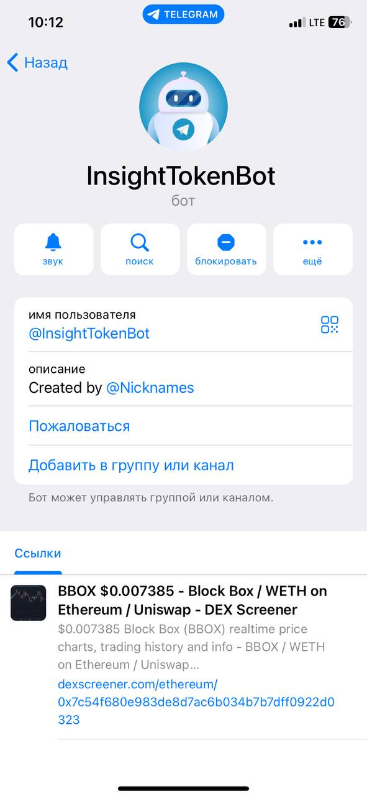
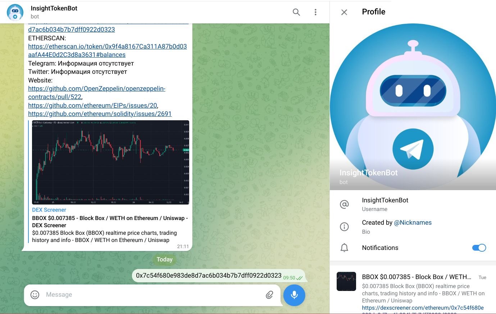

# InfoTokenBot

## Description
This project is a bot that collects information about tokens. It is designed to collect data from various sources 
(such as https://dexscreener.com / https://etherscan.io / and https://tokensniffer.com /) 
and provides users with valuable information and analytics.

## Features
- Collects token information from multiple sources
- Provides detailed data analysis and statistics
- User-friendly interface for easy interaction

## Screenshots

*Usage*

## Installation
1. Clone the repository: `git clone https://github.com/your-username/project.git`
2. Navigate to the project directory: `cd InfoTokenBot`
3. Inside the `.env` file, change the following lines:
   `BOT_TOKEN=YOURS_TOKEN`
   `ADMINS=YOURS_IDS_USERS`
4. Run the project using Docker Compose: `docker-compose up -d`

## Usage
- The container starts automatically when using Docker Compose.
- If you want to manually start the container, navigate to the project directory and run the command: `docker-compose start`

## Contributing
Contributions are welcome! If you have any ideas or suggestions, please open an issue or submit a pull request.

## License
This project is licensed under the [MIT License](LICENSE).
